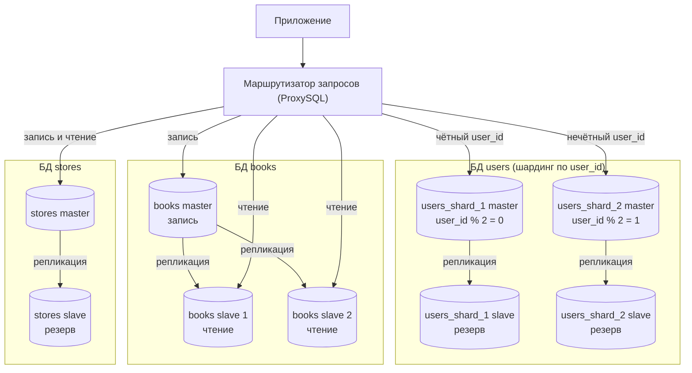

# Домашнее задание к занятию «Репликация и масштабирование. Часть 2» - Левитский Даниил

---

### Задание 1

Опишите основные преимущества использования масштабирования методами:

- активный master-сервер и пассивный репликационный slave-сервер;
- master-сервер и несколько slave-серверов.

#### Ответ

**Активный master + пассивный slave**

Все запросы (и запись, и чтение) обрабатывает master. Slave через репликацию получает с master все изменения и хранит актуальную копию данных, но клиенты к нему не обращаются — это горячий резерв.

Преимущества:
- Отказоустойчивость — если master выйдет из строя, можно быстро переключиться на slave, на котором уже есть актуальные данные. Не нужно восстанавливаться из бэкапа, простой и потери данных минимальные.
- Резервное копирование можно делать со slave, не нагружая master и не мешая работе клиентов.
- Обслуживание без остановки сервиса — на время обновления или ремонта master нагрузку можно перевести на slave.
- Простота — запись идёт только в одно место, конфликтов данных нет, схему легко настроить и поддерживать.
- Slave можно разместить в другом дата-центре, тогда данные сохранятся даже при аварии всего ЦОДа.

**Master + несколько slave**

Запросы на запись идут только на master, а запросы на чтение распределяются между несколькими slave-серверами.

Преимущества:
- Масштабирование чтения — в большинстве систем чтений намного больше, чем записей, поэтому производительность можно увеличивать, просто добавляя новые slave.
- Разделение нагрузки по задачам — например, один slave обслуживает сайт, второй используется для тяжёлых отчётов и аналитики, третий для бэкапов. Тяжёлые запросы не тормозят основной сервис.
- Высокая отказоустойчивость — выход из строя одного slave не критичен, его нагрузку забирают остальные. При падении master любой slave можно сделать новым master.
- Slave можно расположить ближе к пользователям в разных регионах, чтобы ускорить чтение.

В обеих схемах запись не масштабируется, так как master один. Если система упирается в запись, нужен шардинг (задание 2).

---

### Задание 2

Разработайте план для выполнения горизонтального и вертикального шардинга базы данных. База данных состоит из трёх таблиц: пользователи, книги, магазины (столбцы произвольно). Опишите принципы построения системы и их разграничение или разбивку между базами данных.

#### Ответ

**Таблицы**

- `users` — user_id, name, email, password_hash, city, registered_at
- `books` — book_id, title, author, genre, price, year
- `stores` — store_id, name, city, address, phone

**Вертикальный шардинг**

Таблицы разносятся по разным серверам по смыслу, каждая таблица — в своей базе:

- БД `users` — самая большая таблица, много записи (регистрация, вход, изменение профиля).
- БД `books` — каталог, в основном чтение (поиск и просмотр книг), запись редкая (добавление книг, изменение цен).
- БД `stores` — маленькая таблица, меняется редко.

Каждый сервер обрабатывает только свой тип запросов и не мешает остальным. Минус — JOIN между таблицами на разных серверах сделать нельзя, связь хранится через id (user_id, book_id, store_id), а объединение данных делает приложение.

**Горизонтальный шардинг**

Таблица `users` при росте числа пользователей перестанет помещаться на один сервер, поэтому её строки делятся на 2 шарда по ключу `user_id`:

- `users_shard_1` — пользователи с чётным user_id (`user_id % 2 = 0`);
- `users_shard_2` — пользователи с нечётным user_id (`user_id % 2 = 1`).

Деление по остатку даёт равномерное распределение. Если делить по диапазонам (1–1 000 000 на первый шард, дальше на второй), все новые пользователи будут попадать на последний шард и нагрузка будет неравномерной. Когда двух шардов станет мало, можно перейти на `user_id % 4` с переносом части данных.

`books` и `stores` горизонтально не делятся: `books` в основном читается, поэтому масштабируется репликацией (master + несколько slave), `stores` слишком маленькая.

**Маршрутизация**

Между приложением и базами стоит маршрутизатор запросов (например, ProxySQL). Он определяет, куда отправить запрос: в какой шард `users` (по user_id), на master (запись) или на slave (чтение).

**Режимы работы серверов**

| Сервер | Режим | Что делает |
|---|---|---|
| users_shard_1 master, users_shard_2 master | master | запись и чтение своей половины пользователей |
| users_shard_1 slave, users_shard_2 slave | пассивный slave | резерв на случай падения master своего шарда, бэкапы |
| books master | master | запись: добавление книг, изменение цен |
| books slave 1, books slave 2 | активный slave | чтение каталога, нагрузка делится между ними |
| stores master | master | запись и чтение |
| stores slave | пассивный slave | резерв, бэкапы |

Чтение пользователей идёт с master, а не со slave: пользователь изменил профиль и сразу его открыл — со slave он мог бы увидеть старые данные из-за задержки репликации.

**Блок-схема**

Три блока — вертикальный шардинг (каждая таблица на своих серверах), два шарда внутри users — горизонтальный шардинг. Стрелки «репликация» — копирование данных с master на slave.

